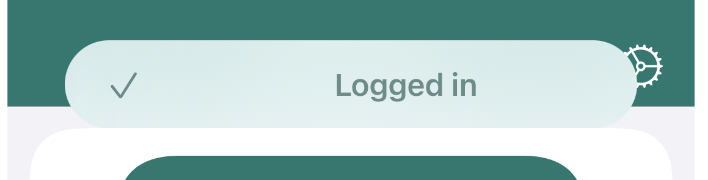

# ALToast



ALToast is a simple swift package that helps you to display small toast messages on your application with minimum effort!

This is the simplest way of showing a toast:

``` swift
let infoMessage = ALMessage.info(message: "Logged in", iconName: "chekmark")
ALToast.info(with: infoMessage, on: self)
```

Easy right!? It gets even easier. If you want to avoid where to show the toast message, you can simply force to show each toast message on top of your app's main window. To do that:
1. Jump into your `SceneDelegate` class;
2. On `sceneWillEnterForeground(_ scene: UIScene)` assign your application's main window to this property:
 ``` swift
 
 // ..
 
 func sceneWillEnterForeground(_ scene: UIScene) {
     ALToast.rootPresentable = UIApplication.shared.windows.first
 }
 
 ```
And you're done! Now you can avoid to call `on: self`  on each of your view controllers.

## Customization

ALToast is super cuastomizable, from the dismiss time interval to the colors.
Using the `ALMessage` struct, you can provide images, text and the toast duration, or change the default duration to the one you prefer.
If you provide a nil duration to the timeInterval property, the toast will never be removed from the view, to remove it you must remove it manually, by keeping a reference of the shown toast.
It's easy to keep a reference of a toast:
``` swift

var myToastMessage: ALToastMessageView?

// ..

myToastMessage = ALToast.info(with: .info("Example", hideAfter: nil)) // passing nil will persist the toast message.

myToastMessage.hide(animated: true)
```

